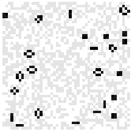

# Task for Python Day 2

### Deadline: 13/07/2021 06:00 PM

## Rules

1. Use only commands, functions, datatypes from [Python Part 2](https://github.com/HorizonIITM/summer-school-2021/tree/master/week-01/python/python-02.ipynb) class.
2. You are free to use whatever resource to learn about the subject of task.
   Please avoid plagiarism - the task is for you to learn, not for us to evaluate
   you.
3. Refrain from using pre-existing libraries/functions/other structures. Both
   problems are completely doable using the content for Python Part 2 class.

## Conway's Game of Life

[Conway's Game of Life](https://en.wikipedia.org/wiki/Conway%27s_Game_of_Life)
is a two-dimensional [cellular
automaton](https://en.wikipedia.org/wiki/Cellular_automaton) defined by [Moore
Neihbourhood](https://en.wikipedia.org/wiki/Moore_neighborhood) of a cell.

In its essence, cellular automaton is a computational model which consist of
"cells", and each cell has a state. The time evolution of the state of every
cell is defined by some specified rules. Conway's Game of Life has its own set
of rules, which are:

1. Any live cell with two or three live neighbours survives.
2. Any dead cell with three live neighbours becomes a live cell.
3. All other live cells die in the next generation. Similarly, all other dead
   cells stay dead.

This is a **zero-player game**: you set-up an initial state and game plays its
part to perfection. You can _play_ the game [online
here](https://gameoflifepro.github.io/).

Your task is to write a function
`conway(init: np.ndarray, niter: int) -> np.ndarray` (here
type hints are used to note the data type of arguments - more about that
[here](https://docs.python.org/3/library/typing.html)). What this function will
do is, take in an numpy array in the `init` argument, consisiting of 1's and 0's
corresponding to _live_ and _dead_ cells respectively and iterate it according
to the rules of Conway's Game of Life for `niter` iterations. The function
should return a numpy array consisting of state of cells after `niter`
iterations. Few important points to note:

1. The original Game of Life is played in an infinite universe (of cells). To
   simulate this in computation there are two options: to set constant boundary
   conditions or periodic boundary conditiosn. For the scope of this summer school
   you are supposed to define a constant boundary conditions - the boundary of the
   simulation should be 0's at all iterations.
2. The entire task so far should be made using only the commands that are taught
   in the Python Part 2 session - this is to ensure you come up with out-of the box
   solutions, rather than utilising some pre-existing library.
3. The answer is composed of two parts: the function `conway()` and the
   visualisation of the test array `test_array`. Both are mandatory for evaluation.
   You should only provide a signle function `conway()` and there should not be any
   other dependency than the modules `numpy` and `matplotlib.pyplot` themselves.

Once you have written such a function, you have to make a visualisation using
matplotlib. The instructions for them are:

1. There is a test array provided in the template notebook named `test_array`.
2. Simulate a game using this array as initial conditiosn, and iterate for _1337_
   steps.
3. Plot both the initial test array, and the game after 1337 steps in the same
   figure using the `matplotlib.pylplot.imshow()` function (more instruction
   and information given in the next section).
4. Save this image in the `python-02/img/` directory with the name format
   `rollnumber.png`.

## Visualisation instruction

Pyplot provides a function to visualise array-type objects - `imshow()`. We
can specify the colormap to use for visualisation, and also the transparency
of the visualisation.

```python
plt.imshow(X, cmap=None, alpha=None)
# X is the array-type object to plot
```

Here we have mentioned only arguments that are relevant to us. For the `cmap`
argument, though there are a plethora of color maps available, we will be using
`binary` for a black-and-white image. Since we mentioned earlier that both
the test data and iterated data should be overlayed, you should apply a value
for the second data not equal to 1. We suggest `alpha=0.9` for a good balance.
We won't be needing the axes and other information for our case, so we will be
disabling them too.

Once the visualisation is done, it should be saved in the directory mentioned
earlier. Pyplot provides a function for saving plots `savefig()`.

So the full procedure for making the visualisation would be:

```python
# plotting the original test array
plt.imshow(test_array, cmap='binary')
# plotting the iterated array, with an alpha of 0.9 so that the original array
# is faintly visible
plt.imshow(iter_array, cmap='binary', alpha=0.9)
# disabling axes and other information
plt.box(False)
plt.axis('off')
# saving the plot in python-02/img/
# the other two parameters are to strip away unnecessary space around the image
plt.savefig('path/to/rollnumber.png', bbox_inches='tight',pad_inches = 0)
```

An example visualisation `example.png` (using a different initial array) is
provided in `python-02/img/` directory.



Your image need not have same patterns, the example is for demonstration
purposes only.

## Submission procedure

1. Fork this repository. (If you have already forked ignore this step.)
2. Clone the forked repository to your system. And go to the cloned repository
   directory. (If you have already cloned ignore this step, but _do_ sync it.)
3. Sync your fork with the original repo, and pull changes before proceeding
   further.
4. Copy the `template.ipynb` from `template` folder to `python-02` folder
   with the name format `rollnumber` (name should be all lowercase only).
5. Put the function `conway()` in this newly copied notebook (we suggest you
   use a different notebook outside the repository for your work, and put only
   the final response in this notebook)
6. Put the visualisation that you generated with given guidelines in the
   `python-02/img/` folder with the name format `rollnumber.png` (once again
   all lowercase letters only)
7. Sync your fork with the original repository, and pull changes from your fork
   to the cloned local repository, before proceeding further.
8. Make sure not to affect any files in the `python-01` directory.
9. Add all the changes, and commit them.
10. Create a pull request with title format `rollnumber_name_conway`. It should
    be in all lowercase, and replace spaces in name with `-`. `name` is your
    name, not your GitHub username.
11. And that's it!
